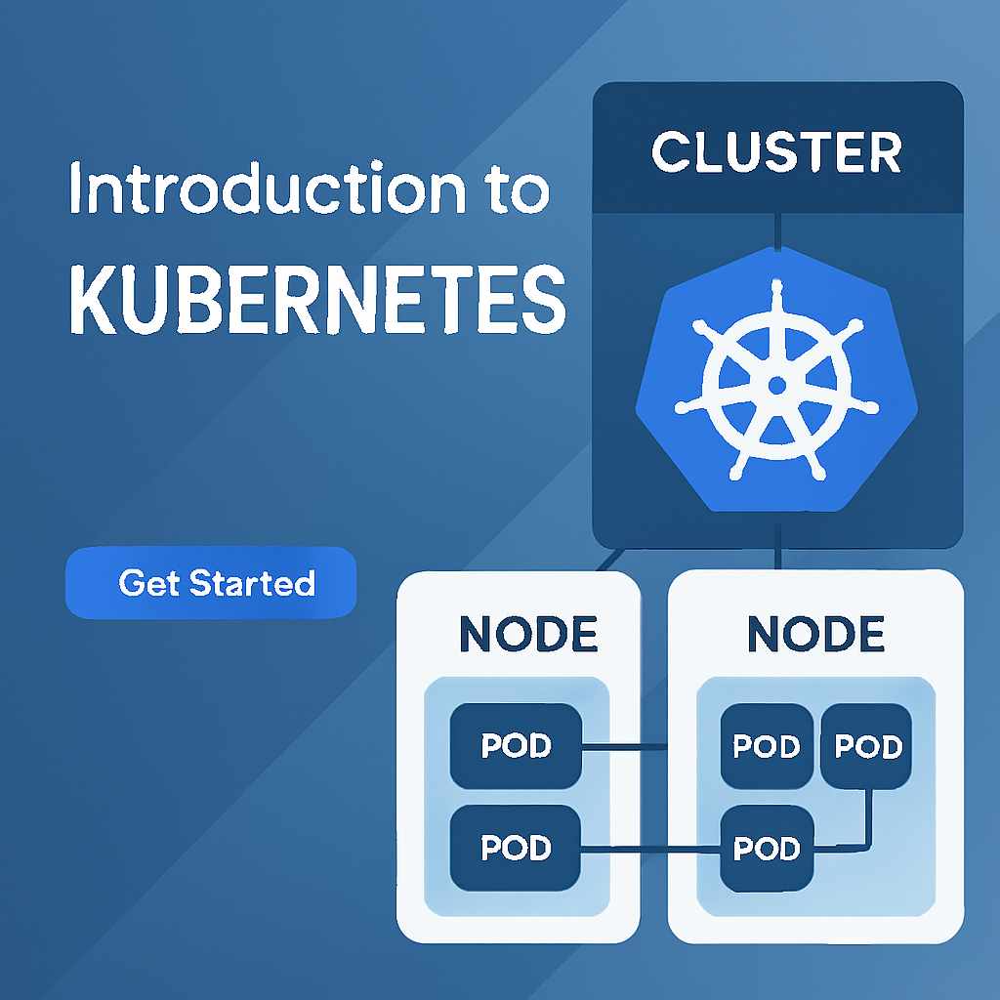
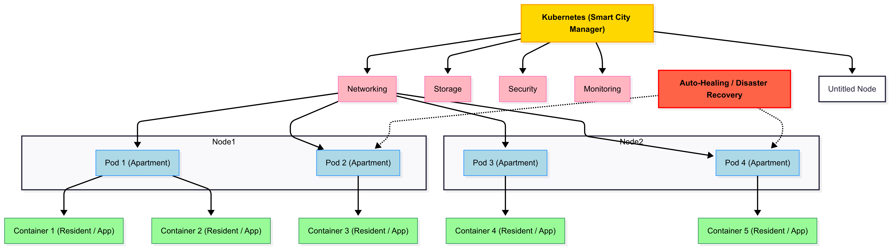

<div align="center">

# 🚢 Introduction to Kubernetes



</div>

---

> **Welcome to the world of Kubernetes!** 
> 
> You're about to embark on an exciting journey into the heart of modern cloud technology where applications scale effortlessly, infrastructure heals itself, and innovation moves at lightning speed. Kubernetes isn't just a tool; it's the backbone of how the world's leading companies run and manage software at scale.


## 🤔 What is Kubernetes?

> **Kubernetes** (often abbreviated as **K8s**) is an open-source container orchestration platform that automates the deployment, scaling, and management of containerized applications. It was originally created by Google, based on their years of experience building reliable and scalable systems using containers. Think of it as the "operating system" for your containerized applications in the cloud.

### 💡 Why "K8s"?
The name "K8s" comes from the 8 letters between "K" and "s" in "Kubernetes" - it's a handy abbreviation used by professionals worldwide!

## 📦 The Container Revolution

Before we dive into Kubernetes, let's understand the problem it solves:

| 🏢 **Traditional Applications** | 📦 **Enter Containers** |
|:---:|:---:|
| Applications ran directly on physical servers | Applications packaged with their dependencies |
| Hard to scale, move, or isolate | Consistent across different environments |
| "It works on my machine" syndrome | Lightweight and portable |
| Resource waste and conflicts | Better resource utilization |

### ⚠️ But Then... Container Management Challenges!

**As organizations started using more containers, new challenges emerged:**

- ❓ **How do we manage hundreds of containers?**
- 💥 **What if a container crashes?**
- 📈 **How do we scale automatically?**
- 🌐 **How do we handle networking between containers?**
- 🔄 **How do we deploy updates without downtime?**

## What Problems Does Kubernetes Solve? 🎯

### 1. **Container Orchestration**
- Automatically schedules containers across multiple machines
- Ensures containers are running where they should be
- Handles container lifecycle management

### 2. **High Availability**
- Automatically restarts failed containers
- Distributes workloads across multiple nodes
- Performs health checks and self-healing

### 3. **Scalability**
- Scale applications up or down based on demand
- Horizontal scaling (more instances) and vertical scaling (more resources)
- Automatic scaling based on metrics

### 4. **Load Distribution**
- Distributes traffic across multiple container instances
- Built-in load balancing capabilities
- Service discovery mechanisms

### 5. **Rolling Updates & Rollbacks**
- Deploy new versions without downtime
- Gradually replace old versions with new ones
- Easy rollback if something goes wrong

### 6. **Configuration Management**
- Separate configuration from application code
- Manage secrets and sensitive data securely
- Environment-specific configurations

### 7. **Storage Orchestration**
- Automatically mount storage systems
- Persistent storage for stateful applications
- Storage lifecycle management

## Real-World Analogy: Kubernetes as a Smart City Manager 🏙️

Imagine Kubernetes as the mayor of a smart city (your cluster):

- **Buildings (Nodes)**: The physical infrastructure where people live
- **Apartments (Pods)**: Where your applications actually run
- **Residents (Containers)**: Your actual applications
- **City Services**: Networking, storage, security, monitoring
- **Traffic Management**: Load balancing and service discovery
- **Emergency Response**: Auto-healing and disaster recovery

Just like a good mayor ensures the city runs smoothly, Kubernetes ensures your applications run efficiently, safely, and reliably.

<div align="center" style="margin: 30px 0;">
  
</div>

## 💡 Why Should You Learn Kubernetes?

| 🎯 **Category** | 📈 **Benefits** |
|:---|:---|
| **🚀 Career Opportunities** | • High demand for Kubernetes skills<br>• Average salary increase of 25-40%<br>• Remote work opportunities<br>• Future-proof technology skill |
| **🛠️ Technical Benefits** | • Industry standard for container orchestration<br>• Cloud-agnostic (works on AWS, Azure, GCP, on-premises)<br>• Huge ecosystem and community support<br>• Transferable skills across organizations |
| **🎯 Business Impact** | • Faster time to market<br>• Improved application reliability<br>• Cost optimization through better resource utilization<br>• Enables DevOps and continuous delivery |

## Common Misconceptions ❌

### "Kubernetes is Only for Large Companies"
**False!** Kubernetes scales from small applications to massive enterprise systems. Many small teams benefit from its automation capabilities.

### "You Need to be a Expert to Use Kubernetes"
**False!** While Kubernetes has a learning curve, with proper guidance (like this handbook!), anyone can learn it step by step.

### "Kubernetes is Just Docker with Extra Steps"
**False!** Kubernetes provides orchestration, scaling, networking, and many other features that Docker alone cannot provide.

### "Kubernetes is Too Complex"
**Partially True!** Kubernetes can be complex, but you don't need to understand everything at once. Start with basics and build up gradually.

## What You'll Learn in This Handbook 📚

By the end of this handbook, you'll be able to:

✅ **Understand** Kubernetes architecture and core concepts  
✅ **Deploy** applications to a Kubernetes cluster  
✅ **Scale** applications based on demand  
✅ **Manage** configuration and secrets  
✅ **Implement** networking and service discovery  
✅ **Monitor** and troubleshoot applications  
✅ **Secure** your Kubernetes workloads  
✅ **Operate** Kubernetes in production environments  

## Your Learning Journey Starts Here! 🎉

Kubernetes might seem daunting at first, but remember:

> **"A journey of a thousand miles begins with a single step"** - Lao Tzu

Every Kubernetes expert was once a beginner. The key is to:

1. **Start with the basics** - Don't rush ahead
2. **Practice regularly** - Hands-on experience is crucial
3. **Be patient** - Some concepts take time to sink in
4. **Ask questions** - The community is very helpful
5. **Build projects** - Apply what you learn immediately

## A Taste of Kubernetes Code 👨‍💻

Before we dive deep, let's look at some simple Kubernetes code to give you a preview of what you'll be working with. Don't worry if you don't understand everything yet - we'll cover each concept in detail!

### Example 1: A Simple Pod (Your First Container in Kubernetes)

```yaml
# my-first-pod.yaml
apiVersion: v1
kind: Pod
metadata:
  name: hello-world
  labels:
    app: hello
spec:
  containers:
  - name: hello-container
    image: nginx:latest
    ports:
    - containerPort: 80
```

**What this does**: Creates a single Pod running an Nginx web server.

### Example 2: A Deployment (Managing Multiple Pods)

```yaml
# my-deployment.yaml
apiVersion: apps/v1
kind: Deployment
metadata:
  name: web-app
spec:
  replicas: 3  # Run 3 copies of our app
  selector:
    matchLabels:
      app: web
  template:
    metadata:
      labels:
        app: web
    spec:
      containers:
      - name: web-container
        image: nginx:latest
        ports:
        - containerPort: 80
```

**What this does**: Creates 3 identical Pods running Nginx, with automatic replacement if any fail.

### Example 3: A Service (Exposing Your App)

```yaml
# my-service.yaml
apiVersion: v1
kind: Service
metadata:
  name: web-service
spec:
  selector:
    app: web
  ports:
  - port: 80
    targetPort: 80
  type: LoadBalancer
```

**What this does**: Creates a load balancer that distributes traffic across your 3 Nginx Pods.

### Basic Commands You'll Learn

```bash
# Deploy your application
kubectl apply -f my-deployment.yaml

# Check if your Pods are running
kubectl get pods

# See your services
kubectl get services

# Get detailed information
kubectl describe pod hello-world

# View application logs
kubectl logs hello-world

# Delete resources
kubectl delete -f my-deployment.yaml
```

### Don't Panic! 😊

Looking at this code, you might think:
- "This looks complicated!"
- "I don't understand any of this!"
- "Maybe Kubernetes isn't for me..."

**STOP!** 🛑 Every Kubernetes expert felt the same way when they first saw YAML files. Here's the truth:

✅ **You don't need to memorize syntax** - You'll learn patterns  
✅ **YAML becomes second nature** - After a few examples, you'll get it  
✅ **Start simple** - We begin with one concept at a time  
✅ **Copy-paste is okay** - Even experts use templates and examples  
✅ **Practice makes perfect** - The more you write, the easier it gets  

## Ready to Begin? 🚀

Now that you understand what Kubernetes is, why it's important, and have seen some code examples, you're ready to start your journey. In the next section, we'll explore the Kubernetes architecture and understand how all the pieces fit together.

Remember: **Every expert was once a beginner. The only difference is they started.**

Let's make you the next Kubernetes expert! 💪
